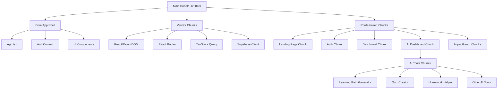

# Bundle Optimization Design Document

## Overview

This design implements a comprehensive bundle optimization strategy for ImpactHub AI using Vite's code splitting capabilities, dynamic imports, and manual chunk configuration. The solution will reduce the initial bundle size from 583KB to under 250KB while maintaining smooth user experience through strategic lazy loading.

## Architecture

### Bundle Splitting Strategy



### Chunk Organization

1. **Core Bundle** (~200KB): Essential app shell, routing, authentication
2. **Vendor Chunks** (~150KB total): Third-party libraries split by usage patterns
3. **Route Chunks** (~50-100KB each): Page-level components loaded on demand
4. **Feature Chunks** (~30-80KB each): AI tools and specialized components

## Components and Interfaces

### 1. Vite Configuration Enhancement

```typescript
// vite.config.ts structure
export default defineConfig({
  build: {
    rollupOptions: {
      output: {
        manualChunks: {
          // Vendor chunks
          'react-vendor': ['react', 'react-dom'],
          'router-vendor': ['react-router-dom'],
          'query-vendor': ['@tanstack/react-query'],
          'ui-vendor': ['@radix-ui/*'],
          'supabase-vendor': ['@supabase/supabase-js'],
          
          // Feature chunks
          'ai-tools': [/* AI component paths */],
          'learn-tools': [/* ImpactLearn component paths */]
        }
      }
    },
    chunkSizeWarningLimit: 300
  }
})
```

### 2. Dynamic Route Loading

```typescript
// Lazy-loaded route components
const Dashboard = lazy(() => import('./pages/Dashboard'));
const AIDashboard = lazy(() => import('./pages/AIDashboard'));
const ImpactLearnDashboard = lazy(() => import('./pages/ImpactLearnDashboard'));

// Route configuration with Suspense
<Route 
  path="/dashboard" 
  element={
    <Suspense fallback={<LoadingSpinner />}>
      <ProtectedRoute>
        <Dashboard />
      </ProtectedRoute>
    </Suspense>
  } 
/>
```

### 3. AI Components Lazy Loading

```typescript
// AI tools loaded on demand
const LearningPathGenerator = lazy(() => import('./ai/LearningPathGenerator'));
const QuizCreator = lazy(() => import('./ai/QuizCreator'));
const HomeworkHelper = lazy(() => import('./ai/HomeworkHelper'));

// Component registry for dynamic loading
const AIComponentRegistry = {
  'learning-path': () => import('./ai/LearningPathGenerator'),
  'quiz-creator': () => import('./ai/QuizCreator'),
  'homework-helper': () => import('./ai/HomeworkHelper'),
  // ... other AI tools
};
```

### 4. Loading States and Error Boundaries

```typescript
// Reusable loading component
interface ChunkLoadingProps {
  fallback?: React.ComponentType;
  error?: React.ComponentType<{error: Error; retry: () => void}>;
}

// Error boundary for chunk loading failures
class ChunkErrorBoundary extends React.Component {
  // Handle chunk loading errors with retry mechanism
}
```

## Data Models

### Bundle Analysis Data

```typescript
interface BundleAnalysis {
  chunks: ChunkInfo[];
  totalSize: number;
  initialBundleSize: number;
  vendorSize: number;
  routeChunks: RouteChunkInfo[];
}

interface ChunkInfo {
  name: string;
  size: number;
  gzipSize: number;
  modules: string[];
  isInitial: boolean;
}

interface RouteChunkInfo extends ChunkInfo {
  route: string;
  loadTime: number;
  dependencies: string[];
}
```

### Performance Metrics

```typescript
interface PerformanceMetrics {
  initialLoadTime: number;
  chunkLoadTimes: Map<string, number>;
  cacheHitRate: number;
  failedChunkLoads: number;
}
```

## Error Handling

### 1. Chunk Loading Failures

```typescript
// Retry mechanism for failed chunk loads
const retryChunkLoad = async (chunkName: string, maxRetries = 3) => {
  for (let i = 0; i < maxRetries; i++) {
    try {
      return await import(/* webpackChunkName: chunkName */ chunkName);
    } catch (error) {
      if (i === maxRetries - 1) throw error;
      await new Promise(resolve => setTimeout(resolve, 1000 * (i + 1)));
    }
  }
};
```

### 2. Network-Aware Loading

```typescript
// Adapt loading strategy based on connection
const getLoadingStrategy = () => {
  const connection = (navigator as any).connection;
  if (connection?.effectiveType === 'slow-2g' || connection?.effectiveType === '2g') {
    return 'minimal'; // Load only essential chunks
  }
  return 'normal'; // Standard loading strategy
};
```

### 3. Graceful Degradation

```typescript
// Fallback for critical chunk failures
const CriticalChunkFallback = ({ error, retry }: {error: Error, retry: () => void}) => (
  <div className="p-4 text-center">
    <p>Unable to load this feature. Please check your connection.</p>
    <button onClick={retry} className="mt-2 px-4 py-2 bg-blue-500 text-white rounded">
      Try Again
    </button>
  </div>
);
```

## Testing Strategy

### 1. Bundle Size Testing

```typescript
// Automated bundle size checks
describe('Bundle Size Tests', () => {
  test('initial bundle should be under 250KB', () => {
    const bundleStats = getBundleStats();
    expect(bundleStats.initialSize).toBeLessThan(250 * 1024);
  });

  test('no chunk should exceed 300KB', () => {
    const bundleStats = getBundleStats();
    bundleStats.chunks.forEach(chunk => {
      expect(chunk.size).toBeLessThan(300 * 1024);
    });
  });
});
```

### 2. Loading Performance Tests

```typescript
// Performance testing for chunk loading
describe('Chunk Loading Performance', () => {
  test('route chunks should load within 2 seconds', async () => {
    const startTime = performance.now();
    await import('./pages/Dashboard');
    const loadTime = performance.now() - startTime;
    expect(loadTime).toBeLessThan(2000);
  });
});
```

### 3. Error Recovery Tests

```typescript
// Test error handling and retry mechanisms
describe('Chunk Error Recovery', () => {
  test('should retry failed chunk loads', async () => {
    // Mock network failure and test retry logic
  });

  test('should show fallback UI for critical failures', () => {
    // Test fallback component rendering
  });
});
```

### 4. Network Condition Tests

```typescript
// Test behavior under different network conditions
describe('Network-Aware Loading', () => {
  test('should load minimal chunks on slow connections', () => {
    // Mock slow connection and verify loading strategy
  });

  test('should preload chunks on fast connections', () => {
    // Mock fast connection and verify preloading
  });
});
```

## Implementation Phases

### Phase 1: Core Infrastructure
- Configure Vite manual chunks
- Implement basic lazy loading for routes
- Add loading states and error boundaries

### Phase 2: AI Tools Optimization
- Split AI components into feature chunks
- Implement dynamic AI tool loading
- Add AI-specific loading states

### Phase 3: ImpactLearn Optimization
- Separate ImpactLearn into independent chunks
- Optimize for low-bandwidth scenarios
- Add offline-friendly loading strategies

### Phase 4: Advanced Optimizations
- Implement preloading strategies
- Add bundle analysis tooling
- Performance monitoring and metrics

## Performance Targets

- **Initial Bundle**: < 250KB minified
- **Individual Chunks**: < 300KB minified
- **Route Load Time**: < 2 seconds on 3G
- **Chunk Cache Hit Rate**: > 90%
- **Failed Load Recovery**: < 5 seconds

## Monitoring and Analytics

### Bundle Analysis Integration
- Automated bundle size reporting in CI/CD
- Visual bundle analysis with webpack-bundle-analyzer
- Performance regression detection

### Runtime Performance Tracking
- Chunk load time monitoring
- Cache effectiveness metrics
- Error rate tracking for chunk loading failures