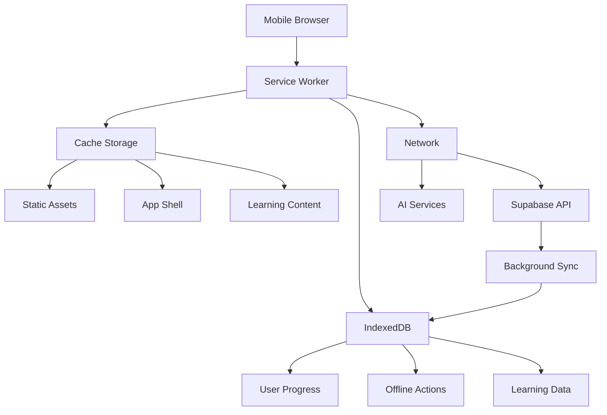

# Mobile PWA Optimization Design Document

## Overview

This design transforms the ImpactHub platform into a mobile-first Progressive Web App with comprehensive offline capabilities, optimized for users in marginalized communities who primarily access the platform via smartphones with limited connectivity.

## Architecture

### PWA Architecture



### Mobile-First Design System

1. **Touch-Optimized Interface**
   - Minimum 44px touch targets
   - Swipe gestures for navigation
   - Pull-to-refresh functionality
   - Bottom navigation for thumb accessibility

2. **Responsive Breakpoints**
   - Mobile: 320px - 768px (primary focus)
   - Tablet: 768px - 1024px
   - Desktop: 1024px+ (secondary)

3. **Offline-First Data Flow**
   - Cache-first strategy for static content
   - Network-first for dynamic data with fallback
   - Background sync for user actions

## Components and Interfaces

### 1. Service Worker Implementation

```typescript
// sw.js structure
const CACHE_NAME = 'impacthub-v1';
const STATIC_CACHE = 'static-v1';
const DYNAMIC_CACHE = 'dynamic-v1';

// Cache strategies
const cacheFirst = ['static assets', 'app shell'];
const networkFirst = ['API calls', 'user data'];
const staleWhileRevalidate = ['learning content'];
```

### 2. Mobile Navigation Component

```typescript
interface MobileNavProps {
  currentRoute: string;
  isOffline: boolean;
  syncStatus: 'synced' | 'syncing' | 'offline';
}

// Bottom tab navigation for mobile
const MobileNavigation = {
  tabs: ['Learn', 'Progress', 'Community', 'Profile'],
  position: 'bottom',
  style: 'native-like'
};
```

### 3. Offline Storage Manager

```typescript
interface OfflineStorageManager {
  // Cache learning content
  cacheLearningModule(moduleId: string): Promise<void>;
  
  // Store offline actions
  storeOfflineAction(action: OfflineAction): Promise<void>;
  
  // Sync when online
  syncOfflineActions(): Promise<void>;
  
  // Manage storage quota
  manageStorageQuota(): Promise<void>;
}
```

### 4. Mobile-Optimized Components

```typescript
// Touch-friendly card component
interface MobileCard {
  minHeight: '80px';
  touchTarget: '44px';
  swipeActions: SwipeAction[];
  hapticFeedback: boolean;
}

// Mobile lesson viewer
interface MobileLessonViewer {
  swipeNavigation: boolean;
  audioControls: 'large';
  textSize: 'adjustable';
  offlineIndicator: boolean;
}
```

## Data Models

### Offline Action Queue

```typescript
interface OfflineAction {
  id: string;
  type: 'progress_update' | 'quiz_attempt' | 'comment' | 'like';
  data: any;
  timestamp: number;
  retryCount: number;
  status: 'pending' | 'syncing' | 'synced' | 'failed';
}
```

### Cache Metadata

```typescript
interface CacheMetadata {
  url: string;
  cachedAt: number;
  expiresAt: number;
  size: number;
  priority: 'high' | 'medium' | 'low';
  type: 'static' | 'dynamic' | 'learning';
}
```

### Mobile App State

```typescript
interface MobileAppState {
  isOnline: boolean;
  isInstalled: boolean;
  syncStatus: SyncStatus;
  storageUsage: StorageUsage;
  networkType: 'wifi' | '4g' | '3g' | '2g' | 'slow-2g';
}
```

## Error Handling

### 1. Network Error Recovery

```typescript
// Retry mechanism with exponential backoff
const retryWithBackoff = async (fn: Function, maxRetries = 3) => {
  for (let i = 0; i < maxRetries; i++) {
    try {
      return await fn();
    } catch (error) {
      if (i === maxRetries - 1) throw error;
      await new Promise(resolve => 
        setTimeout(resolve, Math.pow(2, i) * 1000)
      );
    }
  }
};
```

### 2. Storage Quota Management

```typescript
// Handle storage quota exceeded
const handleStorageQuotaExceeded = async () => {
  // Remove oldest cached content
  // Prioritize essential learning materials
  // Notify user of storage limitations
};
```

### 3. Offline State Management

```typescript
// Graceful degradation for offline features
const handleOfflineState = {
  showOfflineIndicator: true,
  disableNetworkFeatures: ['community', 'ai-tools'],
  enableOfflineFeatures: ['cached-lessons', 'progress-tracking'],
  queueActions: true
};
```

## Testing Strategy

### 1. Mobile Device Testing

```typescript
// Test on various devices and screen sizes
const testDevices = [
  'iPhone SE (375px)',
  'iPhone 12 (390px)', 
  'Samsung Galaxy S21 (360px)',
  'iPad (768px)',
  'Android tablets (various)'
];
```

### 2. Network Condition Testing

```typescript
// Test offline/online transitions
const networkConditions = [
  'offline',
  'slow-3g',
  'fast-3g', 
  '4g',
  'wifi',
  'intermittent connectivity'
];
```

### 3. PWA Feature Testing

```typescript
// Test PWA capabilities
const pwaTests = [
  'install prompt',
  'splash screen',
  'offline functionality',
  'background sync',
  'push notifications',
  'app icon display'
];
```

## Performance Optimizations

### 1. Mobile-Specific Optimizations

- **Image Optimization**: WebP format with fallbacks, responsive images
- **Font Loading**: Subset fonts, preload critical fonts
- **JavaScript**: Tree shaking, code splitting by route
- **CSS**: Critical CSS inlining, unused CSS removal

### 2. Offline Performance

- **Cache Warming**: Pre-cache essential content
- **Lazy Loading**: Load content as needed
- **Compression**: Gzip/Brotli compression for cached content
- **Efficient Storage**: Use IndexedDB for structured data

### 3. Battery Optimization

- **Reduce Animations**: Respect prefers-reduced-motion
- **Efficient Polling**: Use exponential backoff for sync
- **Background Processing**: Minimize background tasks
- **Screen Wake Lock**: Only when necessary

## Implementation Phases

### Phase 1: PWA Foundation
- Service worker implementation
- App manifest optimization
- Basic offline caching
- Install prompts

### Phase 2: Mobile UI Optimization
- Mobile-first responsive design
- Touch-optimized components
- Bottom navigation
- Swipe gestures

### Phase 3: Advanced Offline Features
- Background sync
- Offline action queuing
- Storage management
- Network-aware loading

### Phase 4: Native-like Features
- Push notifications
- Haptic feedback
- Device integration
- Performance monitoring

## Accessibility Considerations

### Mobile Accessibility

- **Touch Targets**: Minimum 44px for all interactive elements
- **Screen Reader**: Proper ARIA labels and navigation
- **High Contrast**: Support for high contrast mode
- **Text Scaling**: Support system font size preferences
- **Voice Control**: Compatible with voice navigation
- **Reduced Motion**: Respect motion preferences

### Offline Accessibility

- **Clear Status**: Offline indicators with screen reader support
- **Alternative Navigation**: Keyboard navigation for all features
- **Error Messages**: Clear, actionable error messages
- **Progress Indication**: Clear progress feedback for sync operations